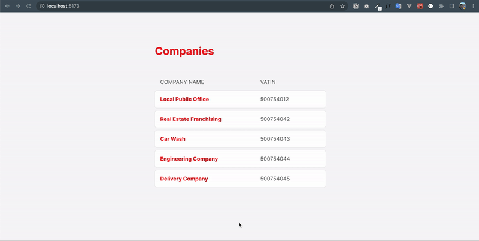

<h1 align="center">
    Companies List
</h1>



## Description
A website presenting a list of companies and their telephone details, based on a API.
## User stories
- User can see the companies data in a list;
- User can navigate clicking on the company name;
- User can see the content based on the company that was selected;

## Requirements:
- Node's latest version installed on your machine.
- https://nodejs.org/en/download/

## How to install and use:

- Install the packages
```
npm install
```
- Initiate server
```
npm run api
```
- Run app in developing mode
```
npm run dev
```

## How to test:
```
npm run test
```

## Technologies:

- [ReactJS](https://reactjs.org/)
- [Vite](https://vitejs.dev/)
- [TypeScript](https://www.typescriptlang.org/)
- [React Context API](https://reactjs.org/docs/context.html)
- [Styled Components](https://styled-components.com/)
- [Vitest](https://vitest.dev/)
- [React Testing Library](https://testing-library.com/docs/react-testing-library/intro/)
